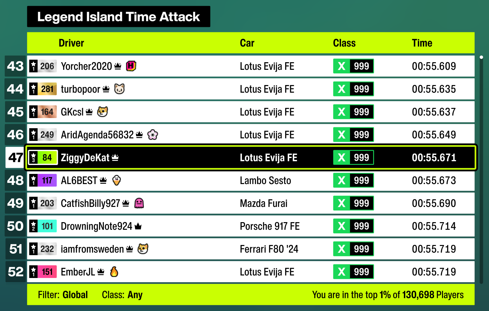
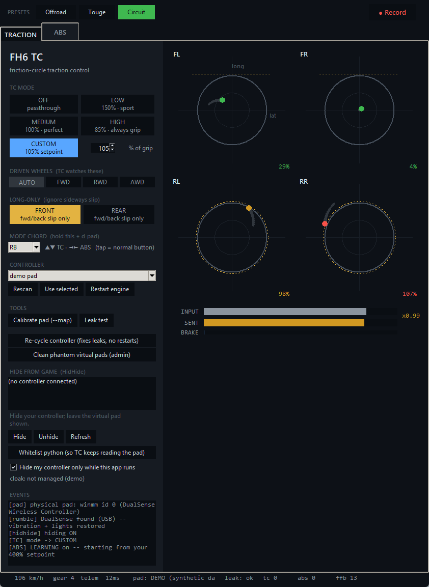
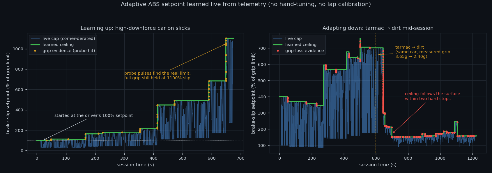
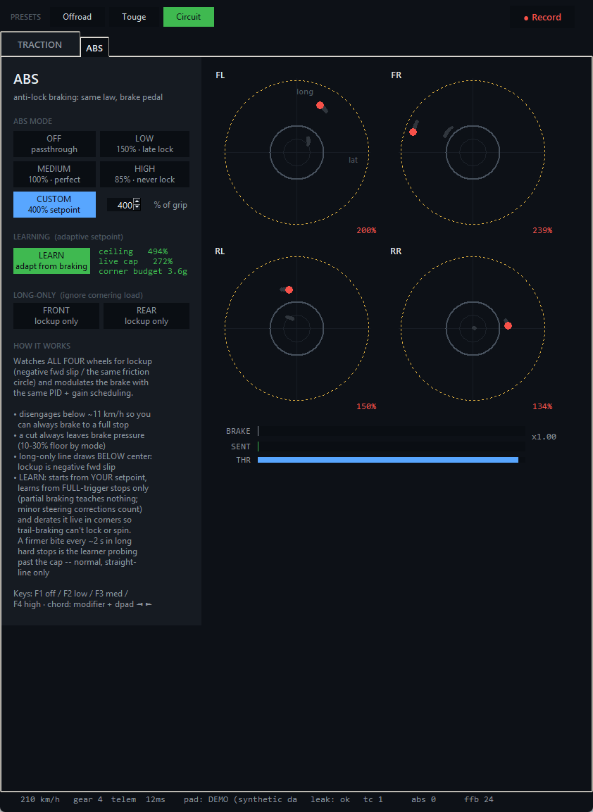

# FH6 TC

**A traction control and ABS you can actually aim.** Forza Horizon 6 has both,
as assists that are on or off. This replaces them with a closed loop that holds
the tires at a **setpoint you choose**: it sits between a physical controller
and the game, reads the game's own per-wheel slip telemetry at 62.5 Hz, and
modulates throttle and brake to ride a chosen fraction of the grip limit. Want
the tires exactly at the limit, or 15% inside it, or 150% of it so the car will
still rotate? That is a number here, per channel, changeable mid-corner. The ABS
setpoint is not even a constant: it is **learned while you drive**, because the
correct value varies by roughly 4x across surfaces and tire compounds.

Written in Python for Windows. No game files are modified and no process memory
is touched; the program is a controller in the control-theory sense, sitting in
the input path.

```
physical pad (winmm)  ->  slip-based PID  ->  virtual Xbox pad (ViGEm)  ->  game
        ^                                                                    |
        |                     UDP telemetry, 62.5 Hz                         |
        +--------------------------------------------------------------------+
```

## Results

**47th in the world out of 130,698 players**, top 1% globally, on the Legend
Island Time Attack leaderboard, in X class (999 performance index, the fastest
class in the game). Set with this software in the loop. The run peaked higher
still: for a while it was the fastest time in the Western Hemisphere.



The car is a Lotus Evija FE, an electric hypercar making roughly 2000 hp, tuned
to **rear-wheel drive**. That combination is close to the worst case a traction
controller can be handed: instant full torque from a standstill, no front axle to
absorb any of it, and two tires to put all of it through. It is also the far end
of the plant-gain range that the gain scheduler exists to cover, where a
fixed-gain loop limit-cycles instead of holding the tires at the grip limit.

A leaderboard time measures the driver as much as the tool, so treat it as
evidence of the obvious kind: the control loop is stable, quick, and useful
enough at the limit to be worth leaving switched on while chasing a competitive
lap, rather than something that had to be turned off when the times mattered.



## Why this is a real control problem

The naive version of this idea does not work, for three reasons that shape the
whole design:

**There is a transport delay of roughly 100 to 120 ms** between sending a
throttle value and seeing the resulting slip in telemetry. That is enormous for
a closed loop. Gains that look reasonable on paper drive the system into a
2.5 Hz limit cycle: the throttle saws, and the car is slower than with no
assistance at all. The derivative term cannot rescue this, because its input is
lagged too. The gains here are deliberately modest and the stability margin is
verified in offline tests that simulate the delayed plant.

**The plant gain varies by an order of magnitude across cars.** Slip produced
per unit of throttle depends on torque, weight, tire and surface. A single set
of PID gains cannot serve a 200 hp hatchback and a 1000 hp hypercar. The loop
solves this with **online gain scheduling**: it continuously estimates plant
gain as measured slip divided by the throttle sent one transport delay ago
(delay-matched, because comparing current-to-current biases the estimate low),
then scales the PID gains by the ratio of a reference gain to that estimate.
Loop gain stays roughly constant across wildly different cars.

**A regulating controller censors the evidence it needs to learn.** This is the
interesting one, and it is the core of the adaptive ABS below.

## Adaptive ABS: learning a setpoint that cannot be a constant

Brake slip at peak grip is not a fixed number. Measured on this game: a
high-downforce car on slicks still holds full braking grip at 1100% of the
nominal slip limit, while rally tires on dirt let go at around 150%. That is a
4x to 7x spread driven by **tire compound and surface**, so no fixed setpoint
and no per-car table can cover it.

So the ABS setpoint is learned live. Turning on LEARN starts the learner from
whatever setpoint the driver has active and adapts from there:



*Left: starting from a conservative 100% setpoint, the learner probes upward and
finds this car's real limit near 1100%. Right: the same car driven from tarmac
onto dirt mid-session. Measured grip drops from about 3.6g to about 2.4g and the
learned ceiling follows it down within two hard stops, then holds. Both panels
are replays of recorded sessions, not simulations.*

The right-hand result is reproducible from this repository. A trimmed extract of
that session is bundled, and `analysis/replay_learner.py` feeds it through the
same learner the live engine uses, with no game or hardware involved:

```
$ python analysis/replay_learner.py
Measured braking grip under matched conditions
    before the transition: 3.64g median over 16 frames
    after  the transition: 2.45g median over 45 frames
    grip lost across the transition: 33%

Learner replayed from scratch (fresh state, same code as the engine)
    started at 400% of the nominal slip limit
    ceiling before the transition: 761% peak
    ceiling at the end:            151%
```

### The exploration problem

Once the controller regulates slip at the ceiling, it prevents slip from ever
exceeding the ceiling. The evidence needed to discover that more grip exists
beyond the current setpoint is exactly the evidence the controller suppresses.
Passive observation cannot escape a conservative starting point: measured on the
rig, the ceiling sat still for six and a half minutes with 49 frames of
near-miss evidence stuck just below threshold.

Two mechanisms break the deadlock:

**Cut-onset overshoots are free open-loop probes.** Because of the transport
delay, the first roughly 8 frames after a cut command still reflect *full* brake
torque at the wheels. Slip overshoots the ceiling during that window while the
tire is being asked for everything it has. That is a genuine measurement of the
surface just past the current setpoint, available on every hard stop at no cost.

**Deliberate probe pulses.** During hard straight-line braking, the controller
briefly releases the cut (120 ms, at most once every 2 s, never in corners,
never with unloaded wheels) and lets the surface answer at full torque. Grip
holding past the cap ratchets the ceiling up; grip collapsing walks it down.

### Deciding what counts as evidence

Most of the engineering here is in refusing to learn from misleading frames.
Each of these gates exists because the naive version produced a measurably wrong
answer on real recorded data:

| Gate | Why it exists |
|---|---|
| Full pedal only (>=90%) | At 65% pedal the car decelerates at 65% of maximum *with grip to spare*, which is indistinguishable from grip falloff. Accepting partial-pedal frames bled the ceiling downward during normal driving. |
| Delay-matched actuator state | Gates judge the torque sent one transport delay ago, not the current command, so neither the controller's own cut nor a brake release can masquerade as the surface letting go. |
| Grip reference fitted against speed squared | Downforce scales with v^2, so available grip is speed-dependent. A single reference learned at 380 km/h condemned honest 170 km/h braking as sub-grip and stalled learning. Three speed-band knots are fitted and evaluated at each frame's own speed. |
| Total g-vector, longitudinal slip | Evidence is judged on hypot(deceleration, lateral) so grip spent on minor steering corrections still counts as grip, while the slip signal uses only the lockup direction so cornering cannot inflate it. Demanding dead-straight braking starved the learner on a real circuit. |
| Vertical-acceleration band | Braking over a crest unloads the wheels and reads exactly like total grip collapse: free-fall shows vertical acceleration near -9.8 m/s^2, slip saturates, deceleration dies. Airborne frames teach nothing. |
| Slip-collapse rejection | Slip falling faster than 10/s is the wheel re-gripping after a cut, on reduced torque. Its low deceleration is the controller's own doing, not the surface's. |
| Two-event confirmation for downward jumps | A real tire or surface change collapses grip on *every* stop; braking across grass after a single off-track excursion is one event. Requiring persistence across two separate braking events distinguishes them. |

### Cornering safety

The learned ceiling is a straight-line number, and asking for straight-line
brake pressure mid-corner would spin the car. The live cap is therefore derated
by the friction circle:

```
live cap = learned ceiling * max(0.25, 1 - (lateral / lateral_budget)^2)
```

The lateral budget is itself learned, and only from lateral load observed
**while braking**: aerodynamic sweepers generate over 8g of lateral load with no
brake applied, and letting those inflate the budget made the derate toothless.
This is what makes trail-braking safe. The learner can never ask for more brake
than the corner has grip left to give.

## Architecture

Three modules, four threads, one pure-logic core.

| Module | Responsibility |
|---|---|
| `traction_control.py` | Control engine and CLI. Holds the pure controller logic, the adaptive learner, the input-chain plumbing, and the offline test suite. |
| `tc_gui.py` | tkinter GUI, HidHide orchestration, and a synthetic engine so the whole interface runs with no game, no pad and no drivers installed. |
| `fh6_telemetry.py` | Forza "Data Out" UDP packet parser, including the byte-offset layout and the Horizon-specific gap between the sled and dash blocks. |
| `analysis/` | Offline replay of recorded sessions through the learner, plus a bundled sample extract. |

Key types in the engine:

- **`TractionController`** is the regulation law and is deliberately free of
  I/O. It is instantiated twice, once for throttle and once for brake, with
  different setpoint tables and wheel selection. Because it is pure, essentially
  all of the control behavior is unit-testable without hardware.
- **`AbsLearner`** owns the adaptive setpoint: grip references, probe evidence
  classification, and the friction-circle derate. Also pure.
- **`TCEngine`** is the threaded loop that ties them to real devices: read the
  physical pad, apply both controllers, write the virtual pad, service the
  learner, feed the recorder and leak detectors.
- **`DualSenseRumble`** forwards force feedback and drives the controller
  lights over raw HID output reports.

Threads: the control loop runs at roughly 250 Hz; a receiver thread drains UDP
telemetry so the loop never blocks on the network; the GUI renders at 30 Hz off
snapshots; a writer thread owns HID output to the physical controller; console
status printing is pushed off the control path entirely, so a frozen console
cannot stall the input chain.

## Windows input-stack work

Getting a modulated input to actually reach a game turned out to be harder than
the control problem, and most of it was diagnosed empirically.

**The game reads every connected controller simultaneously.** With both the
physical pad and the virtual pad visible, the raw trigger overrides every cut.
The fix is cloaking the physical device with HidHide while whitelisting this
program so it can still read it. HidHide cannot hide XInput devices from XInput
games, but it does work for a DirectInput HID pad, which is what a DualSense
presents as.

**Cloaking is evaluated when a process opens the device**, so a game that was
already running keeps its handle and keeps leaking. Rather than requiring the
user to close everything, the program detects running holders and cycles the
controller's USB node, which is a replug with no cable: existing handles are
invalidated and cannot be reopened through the cloak.

**Steam Input is a second leak path that cloaking cannot close**, because Steam
reads the controller itself and re-broadcasts it to the game as its own virtual
device. The signature is unmistakable in telemetry once you know to look: the
game's echoed throttle alternates between exactly the sent value and exactly the
raw trigger.

**Leak detection is duty-cycle based, not average based.** An intermittent leak
leaves a 6-second mean close to the commanded value, so averaging reports clean
while the input path is visibly broken. Counting stray frames catches it. The
game echoes its accepted inputs back in telemetry, which makes the whole chain
verifiable from the outside: a built-in leak test commands a known throttle and
reads back what the game actually accepted.

**Force feedback and the controller lights** had to be rebuilt after cloaking,
since the game's rumble goes to the virtual pad, which has no motors. The engine
subscribes to the virtual pad's feedback notifications and writes raw HID output
reports to the DualSense (USB report `0x02` and Bluetooth `0x31` with its CRC),
carrying motor values and light state in the same report. The five player LEDs
turn out to be wired as three mirrored channels rather than five addressable
ones, so level is encoded as a count growing outward from the center.

## Testing

The control logic is pure by design, so it is tested without a game, a
controller, or any driver installed:

```bash
python traction_control.py --selftest    # ~190 assertions, no hardware
python tc_gui.py --smoke                 # GUI construction and render
python tc_gui.py --demo                  # full GUI on synthetic telemetry
```

The suite is not only unit assertions. It includes **delayed-plant simulations**
that drive the controller against a synthetic vehicle with the measured
transport delay, at multiple plant gains, and assert bounded peak-to-peak
oscillation. That is what caught the limit cycle that hotter gains produce, and
it is why the gain-scheduling range is what it is. The learner is tested against
synthetic braking events with known grip knees in both directions, plus every
evidence gate individually.

Beyond offline tests, the recorder writes the full telemetry stream plus the
learner's complete per-frame decision trail (what it saw, what it decided, and
which gate rejected a frame) so on-track behavior can be audited afterward and
replayed through modified logic. Most of the constants in the learner were set
or corrected from those replays rather than by feel, and every gate in the table
above was added because a replay showed the previous version reaching a
measurably wrong conclusion.

`analysis/replay_learner.py` is that workflow in miniature: it reruns a bundled
recording through the learner and prints the headline measurements, so the
claims in this README can be checked instead of believed.

## Quick start

**Requirements:** Windows 10 or 11, Python 3.12, a DirectInput controller
(developed against a DualSense), Forza Horizon 6.
[ViGEmBus](https://github.com/nefarius/ViGEmBus) is required for the virtual
pad; [HidHide](https://github.com/nefarius/HidHide) is strongly recommended,
since without it the game hears both controllers and cuts leak.

```bash
python -m venv .venv
.venv\Scripts\pip install -r requirements.txt
```

Then:

1. Install **ViGEmBus** and reboot.
2. In the game: Settings, HUD and Gameplay, **Data Out: ON**, IP `127.0.0.1`,
   port `7777`.
3. Launch with **`Launch FH6 TC.bat`**, or run `python tc_gui.py`.
4. **Calibrate the pad** once with the GUI's *Calibrate pad* button.
5. Install **HidHide**, reboot, then use the GUI's *Hide from game* panel to
   hide the physical pad and whitelist Python. Confirm with the *Leak test*
   button.
6. If the game runs through Steam, **disable Steam Input for it** (game
   Properties, Controller, Disable Steam Input), then fully exit and reopen
   Steam.

Hiding is scoped to the app's lifetime: the cloak goes on at startup and off at
exit, so the controller behaves normally everywhere else. A watchdog re-asserts
it if it is ever found off while hiding is expected.

No game or controller handy? `Demo (no game needed).bat` runs the entire
interface on synthetic telemetry.

## Using it

**Modes** apply per channel, to throttle and brake independently:

| Mode | Setpoint | Feel |
|---|---|---|
| OFF | passthrough | nothing is modulated |
| LOW | 150% | sport: slides and launches allowed, burnout clipped |
| MEDIUM | 100% | rides the edge of the grip circle exactly |
| HIGH | 85% | stays inside the circle, launch-controls a standing start |
| CUSTOM | 30-250% TC, 30-600% ABS | any setpoint, gains interpolated from the anchor modes |

Switch modes from the GUI, from the keyboard (F5-F8 for traction, F1-F4 for
ABS, accepted only while the game is focused so a stray keypress elsewhere
cannot disable assistance), or from the controller by holding a chord modifier
and tapping the D-pad. The modifier is selectable, since holding Back while
reaching for the D-pad is two jobs for one thumb; a bumper splits the chord
across both hands. A quick tap of the modifier still performs its normal in-game
function.

**Presets** set both channels at once:

| Preset | TC | ABS |
|---|---|---|
| Offroad | 250%, longitudinal only | 150%, longitudinal only |
| Touge | 125%, longitudinal only | 400%, longitudinal only |
| Circuit | 105%, longitudinal front | 400%, full circle |

**Per-axle longitudinal-only toggles** make a channel watch only forward and
backward slip on that axle and ignore sideways slip. Rear longitudinal-only is
drift-friendly traction control: drift angle stops counting against the
setpoint, while genuine wheelspin is still cut. The trade-off is documented in
the code: it disables the mid-corner oversteer guard for that axle.

**The controller lights are a status display.** Each armed channel maps its
setpoint to a hue within its own range, green for tight assistance through red
for permissive, and the lightbar shows the blend; with LEARN on, the hue drifts
as the ceiling adapts. An actively cutting channel strobes the bar in its own
color at about 5 Hz. Holding the chord modifier turns the bar white and displays
the mode level on the player LEDs.



## Notes and limitations

- Both channels only ever *reduce* input. Steering and every button pass
  through untouched, and the program cannot apply throttle or brake the driver
  did not ask for.
- Only one process can receive the game's Data Out stream. Do not run another
  telemetry consumer at the same time.
- ABS disengages below about 11 km/h so the car can always be brought to a
  complete stop, and a cut always leaves some brake pressure.
- The learned setpoint is session state and is not persisted, since the correct
  value is a property of the current car and tires.
- Tested against one game on one rig. The telemetry format is shared across
  recent Forza titles, but the slip scale calibration here was measured on this
  one.

## License

[PolyForm Noncommercial 1.0.0](LICENSE). Read it, modify it, learn from it,
and use it for anything noncommercial: personal use, hobby projects, study,
research, teaching. Commercial use is not licensed.

It is deliberately source-available rather than open source in the OSI sense.
The whole implementation is here to be read and taken apart, which is most of
what people want from a project like this; what the license withholds is the
right to sell it.

Historical note: commit `03a8be9` and earlier were published under the MIT
license, and anyone who obtained a copy under those terms keeps them. The
change applies from the following commit onward.

Not affiliated with, endorsed by, or connected to the game's developer or
publisher. This is a personal project that reads a documented telemetry output
and synthesizes controller input; it modifies no game files and reads no game
memory.
